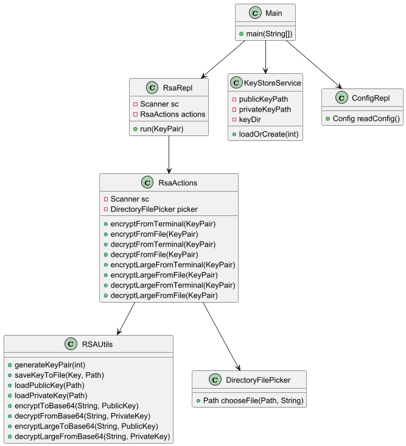

<table border="0">
 <tr>
    <td></td>
    <td>
      <p>Universiteti i Prishtinës</p>
      <p>Fakulteti i Inxhinierisë Elektrike dhe Kompjuterike</p>
      <p>Inxhinieri Kompjuterike dhe Softuerike - Programi Master</p>
      <p>Profesori: Prof. Dr. Blerim REXHA</p> 
      <p>Asistenti: PhD.c Mërgim H. HOTI</p>
      <p>Lënda: Sigurimi i Informacionit</p>
    </td>
 </tr>
</table>

# RSA Text Encryption System in Java
### *Development of an application for text encryption using the RSA algorithm in Java*

---

##  Overview

This project implements a complete **RSA-based text encryption and decryption system** in **Java**, developed as part of the *Information Security* course at the University of Prishtina.

The system supports:

- **RSA key generation** (1024, 2048, 4096 bits)
- **Automatic key storage** (`data/keys`)
- **Configurable RSA transformations**
    - `RSA/ECB/PKCS1Padding`
    - `RSA/ECB/OAEPWithSHA-256AndMGF1Padding`
- **Encryption/Decryption for small text (single block RSA)**
- **Encryption/Decryption for large text (chunked RSA)**
- **Base64 input/output operations**
- **Custom public/private key usage from Base64**
- **Interactive menu-driven REPL interface**
- **File input and output encryption workflow**

This implementation demonstrates the practical application of asymmetric cryptography, secure data handling, chunk-based encryption, and key management—all core concepts in the course.

---

## Project Structure


```plaintext
rsa_encryption_is_gr1_2025/
│
├── data/
│   ├── input/          # Plaintext files
│   ├── output/         # Encrypted/decrypted files
│   └── keys/           # Stored RSA keys
│       ├── public.key
│       └── private.key
│
├── src/
│   └── main/java/org/example/
│       ├── parsers/
│       │   ├── FileInputParser.java
│       │   └── InputParser.java
│       ├── services/
│       │   ├── ConfigRepl.java
│       │   ├── KeyStoreService.java
│       │   ├── RsaActions.java
│       │   └── RsaRepl.java
│       ├── utils/
│       │   ├── RSAUtils.java
│       │   └── DirectoryFilePicker.java
│       ├── KeyGeneratorScript.java
│       └── Main.java
│
└── pom.xml
```
---
## How It Works (Core Components)

### **Main.java**
- Reads RSA configuration (key size + padding)
- Loads/creates keys
- Starts REPL interface

### **KeyStoreService**
- Ensures key directory exists
- Loads existing keys or generates new ones

### **RsaRepl**
- Displays menu and routes the selected option
- Handles interaction flow

### **RsaActions**
Implements:
- Encryption/decryption logic
- File parsing
- Chunked RSA operations
- Custom key support

### **RSAUtils**
- Key generation
- Block-size calculation
- Encryption / decryption (single & large)
- Base64 encoding utilities

---

## Cryptographic Design 

The system is intentionally designed as an educational implementation of the RSA cryptosystem and highlights key architectural choices:

- **Asymmetric Encryption Workflow:**  
  The system demonstrates how public-key encryption operates, how keys are generated, stored, and reused across sessions.

- **Configurable RSA Transformations:**  
  Users may select between `PKCS1Padding` and `OAEPWithSHA-256`, enabling hands-on comparison of padding schemes.

- **Chunked RSA Implementation:**  
  The project implements multi-block RSA processing for large input data, illustrating block-size constraints and real cryptographic workflow.

- **Key Persistence:**  
  Keys are stored locally to showcase how long-term key material can be reused across encryption/decryption cycles.

- **Base64 Encoding:**  
  All encrypted output is Base64-encoded to ensure transport safety and interoperability between systems.

These design decisions help demonstrate the internal mechanisms of RSA and give students a practical understanding of asymmetric cryptography.

---
## System Architecture Diagram

Below is the UML diagram representing the main structure and flow of the RSA encryption system:

<p align="center">
  <br>
  <em>Figure 1: System Architecture UML Diagram for the RSA Encryption Application</em>
</p>


---

## Running the Project

### Requirements
- **Java 21** (or 17+)
- **Maven 3.9+**

### Build
```bash
mvn clean install
```
### Run
```bash
mvn exec:java -Dexec.mainClass=org.example.Main
```
---
## Contributors
- [Fatjeta Gashi](https://github.com/fatjetagashi)
- [Florian Saqipi](https://github.com/floriansaqipi)

---

## Acknowledgments

- **Professor / Course Instructor:** _Prof. Dr. Blerim REXHA_ — for providing the theoretical foundations of cryptography and information security that guided the development of this RSA-based encryption system.

- **Assistant:** _PhD.c Mërgim H. HOTI_ — for continuous support, guidance, and clarification throughout the project, especially regarding secure implementation practices and cryptographic workflows.

- Everyone on the project team.

---

